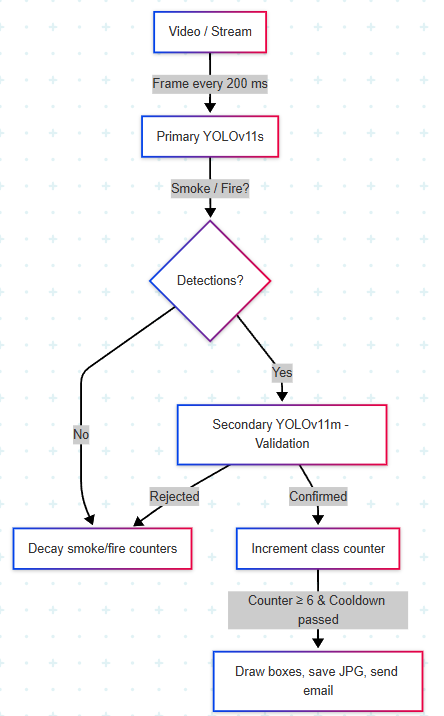

# Wildfire Smoke & Fire Detection Pipeline using YOLOv11

A real-time computer vision system that detects wildfire smoke and fire in rural, outdoor video streams using a dual-YOLO architecture, lightweight ensembling, temporal validation logic, and automated email alerts. Built to run on edge devices or servers, the pipeline prioritizes early smoke detection, the most reliable indicator of a wildfire, while keeping false positives low.

### Motivations

Wildfires are incredibly destructive, causing billions in damage and threatening lives. According to NOAA, wildfire damages in the U.S. rose from 8.6 billion (2012–2016) to 81.6 billion (2017–2021), a nearly tenfold increase. Recent fires in the Los Angeles area further highlight how quickly these disasters can escalate and the devestating impact they can have on communities.

These events often begin in remote or unmonitored regions, where early detection is difficult due to limited manpower and infrastructure. This project was driven by the need for a lightweight, real-time detection system capable of identifying fire and smoke, the most reliable and earliest visual indicator of wildfire, using outdoor video streams from fixed cameras or drones. The pipeline was designed to be plug-and-play, easy to deploy, and robust enough to operate continuously on edge devices, enabling greater monitoring coverage without additional human resources.

### Project Demonstration

### How the Pipeline Works (Overview)

  

| Component                  | Purpose                                                                 |
|---------------------------|-------------------------------------------------------------------------|
| **Frame throttling**      | Caps processing at 5 FPS to reduce compute load.                           |
| **Primary model (YOLOv11s)** | Fast, light model for first‑pass detection.                          |
| **Secondary model (YOLOv11m)** | Larger model that validates only *potential events*.
| **Symmetric decay counters** | +1 on confirm, –2/–3 on reject/idle → requires consistent evidence before alerting and auto‑suppresses false positives and negatives.     |
| **Alert cooldown**        | Prevents duplicate emails (user‑set in `config.yaml`).                  |
| **Email module**          | Sends annotated JPEGs via SMTP so stakeholders can act immediately.     |

### Running the Pipeline
To see the pipeline in action and understand how it functions end-to-end, refer to the interactive demo included in the `demo_pipeline.ipynb` Jupyter Notebook. It walks through the core components, model loading, frame inference, and alert logic.

### Model Training & Data Sources (*Summary*)
This dataset was compiled from multiple public sources, including Kaggle and Roboflow, and carefully picked to support real world wildfire detection. Out of the final 5,767 images, the majority were hand annotated to ensure consistency in labeling, particularly around smoke plume coverage.

For a detailed breakdown of the data sourcing, filtering, annotation process, and training strategy, see the `Model_Training.md` document.

Two models trained **from scratch** on the final dataset:

| Model    | Params | mAP 0.5 Smoke | mAP 0.5 Fire | Overall mAP 0.5 | Purpose   |
|----------|--------|----------------|---------------|------------------|----------------|
| YOLOv11s | 9 M    | **0.84**       | 0.74          | **0.79**         | **Production** |
| YOLOv11m | 25 M   | 0.86           | **0.738**      | 0.80             | Validation     |

Smoke performance was heavily prioritized because it provides the earliest visual cue of a developing wildfire.

### In-Depth Pipeline Logic
#### 1. **Frame Throttling**
- `target_fps = 5` → ~200 ms per processed frame  
- Reduces computational load without sacraficing efficacy
#### 2. **Primary Inference (YOLOv11s)**
- Runs on each throttled frame  
- If no objects detected:  
  → Smoke & fire counters decay by 3  
- If Smoke or Fire is detected → triggers secondary validation
#### 3. **Secondary Validation (YOLOv11m)**
- Runs only when primary model detects a potential event  
- Confirms or rejects each class individually 
- Counter logic: 
  - `+1` on confirm (max 20)  
  - `–2` on reject (fire)  
  - `–2` on reject (smoke)  
  - Alert requires ≥ 6 consistent confirmations
  - This decay-based system allows a “danger level” to build up over time, offering a buffer against both false positives (by requiring multiple confirmations) and false negatives (by not discarding detections prematurely)
#### 4. **Alerting & Rate Limiting**
- Triggered when `smoke_counter ≥ 6` or `fire_counter ≥ 6` and `can_alert()` is `True`  
- Actions:
  - Draw bounding boxes with confidence values  
  - Save annotated frame to `detections/`  
  - Send email with attached image  
- `can_alert()` enforces a cooldown between alerts (e.g., 10 minutes)
#### 5. Citations
If you use or reference this project, please cite the original datasets and pretrained models below:
##### **DFire Dataset**

**Citation:**
Gaia Sánchez-Díaz, Alberto García-Serrano, Diego Martínez. *DFireDataset: A Dataset for Wildfire Smoke and Flame Detection.* GitHub Repository.  
Available at: [https://github.com/gaiasd/DFireDataset](https://github.com/gaiasd/DFireDataset)

##### **Wildfire Smoke Detection (WSDataset)**

**Citation:**
Vũ, Quang Vinh, Trần, Công, and Đạt Trần, Anh. *Ứng dụng trí tuệ nhân tạo để phát hiện bất thường trong giám sát rừng.*  
Journal of Science and Technology on Information and Communications, 2023, 1(4), pp. 118–124. 
Available at: [https://www.kaggle.com/datasets/gloryvu/wildfire-smoke-detection](https://www.kaggle.com/datasets/gloryvu/wildfire-smoke-detection)
##### **Roboflow Wildfire Smoke Dataset**

**Citation:**  
Roboflow. *Wildfire Smoke Object Detection Dataset.*  
Available at: [https://public.roboflow.com/object-detection/wildfire-smoke](https://public.roboflow.com/object-detection/wildfire-smoke)

   
    

